## Aplicativo que controla as fichas dos clientes da academia

### Tecnologias utilizadas:
* React Native
* Node
* Typescript
* Redux
* ...

## Tela de Login
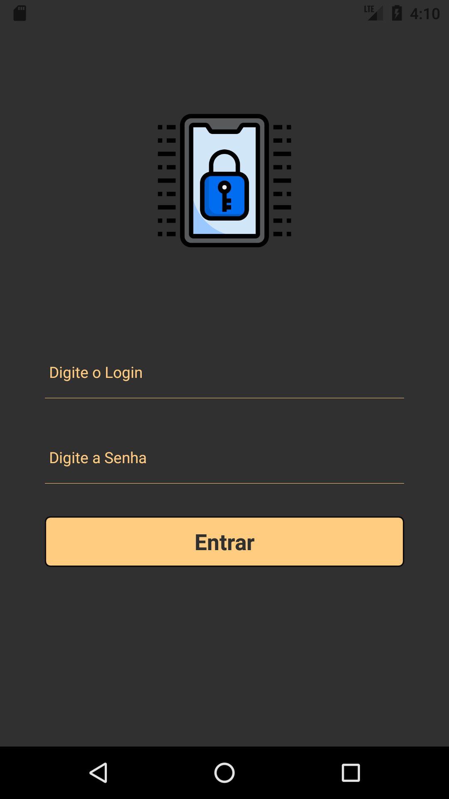

 

## Home
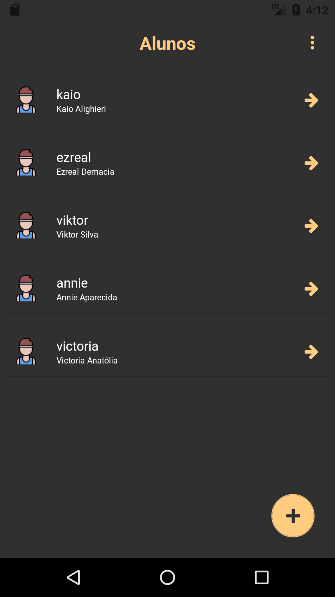

 

## Home Menu

## Pesquisar
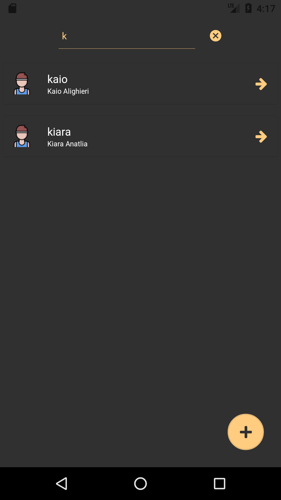

## Sair
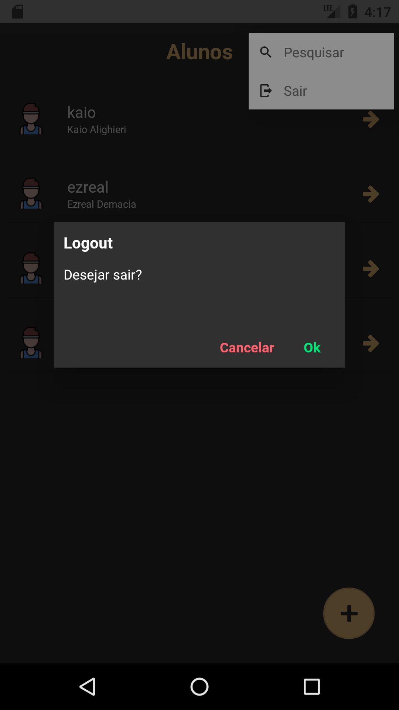

 

## Adicionar novo aluno
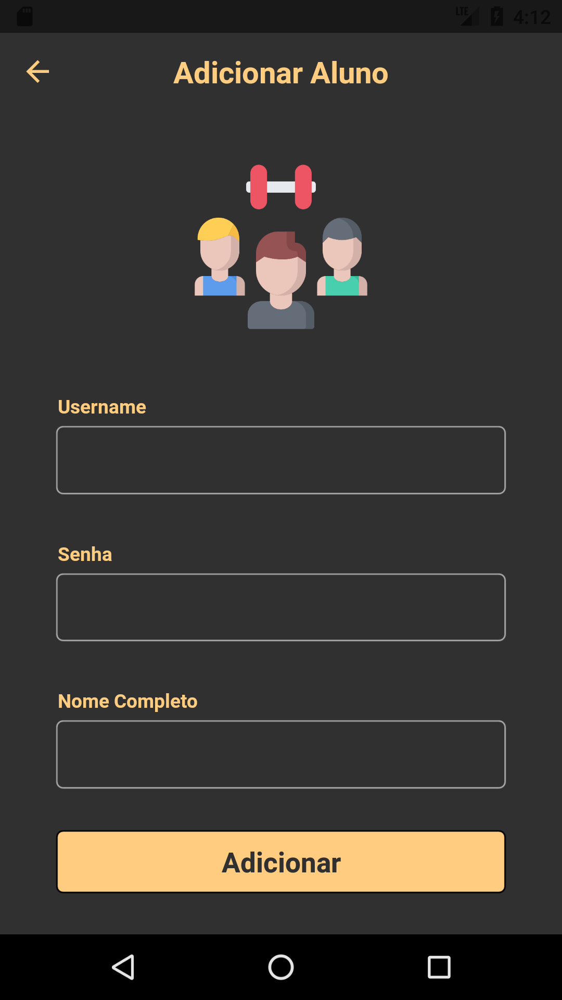

 

## Home - Ações
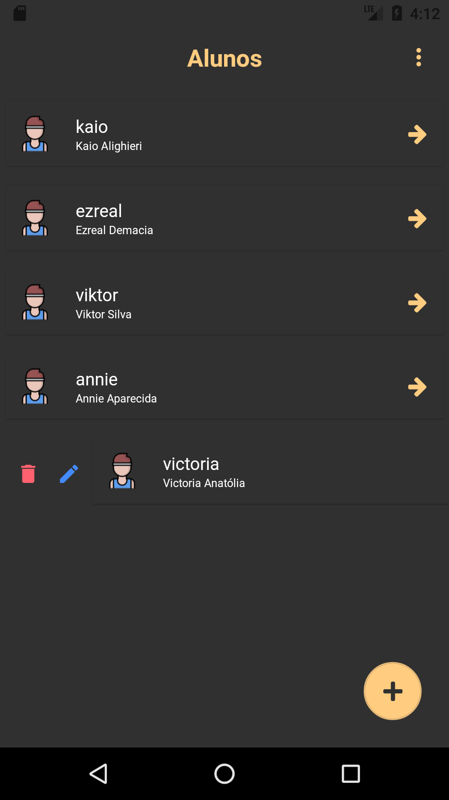

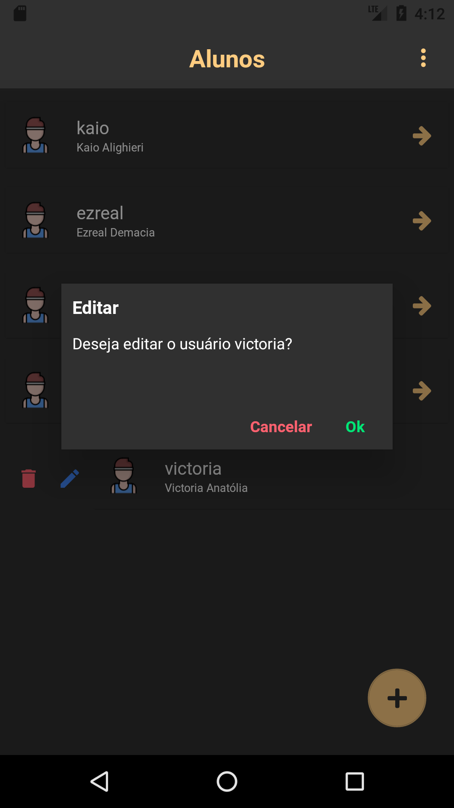

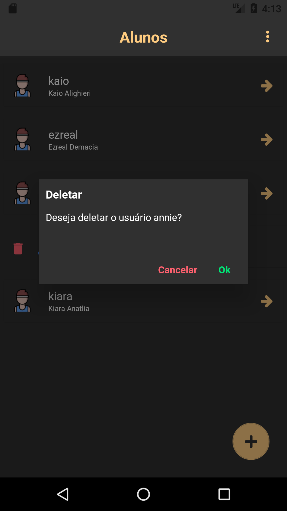

 

## Editar usuário
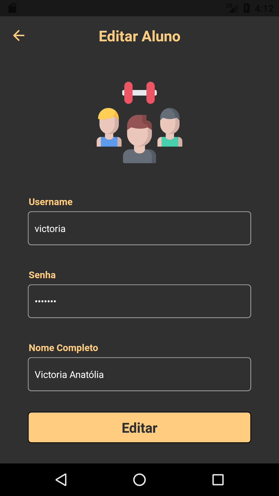

 

## Treinos
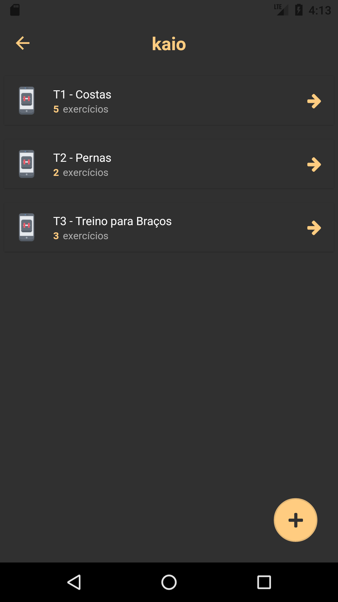

 

## Adicionar Treino
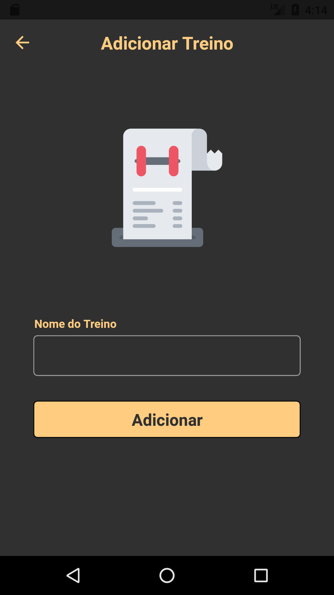

 

## Treino - Ações
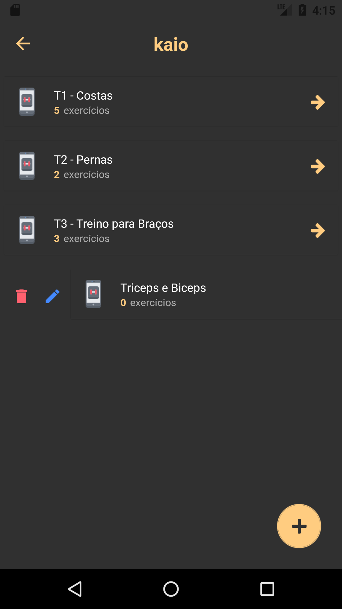

 

## Exercícios
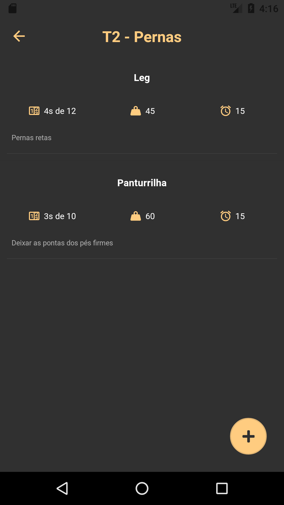

 

## Exercícios - Ações

 

## Adicionar rxercício
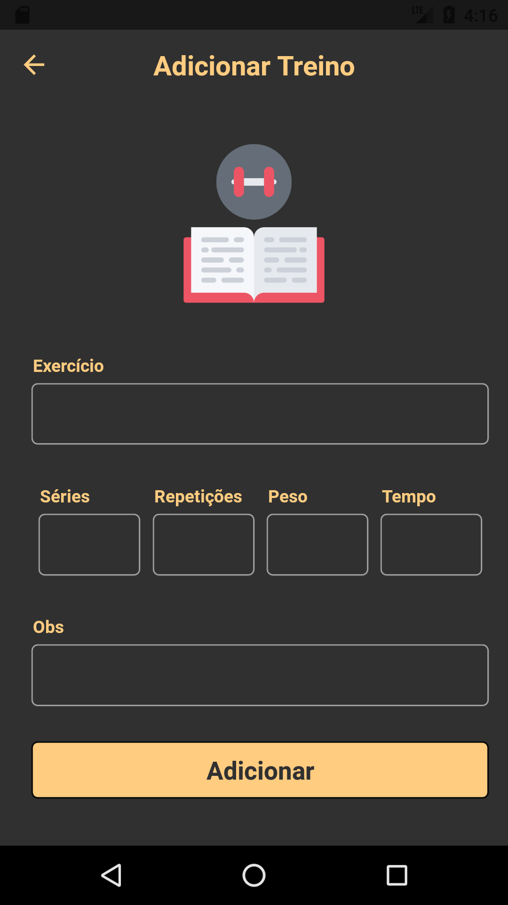
