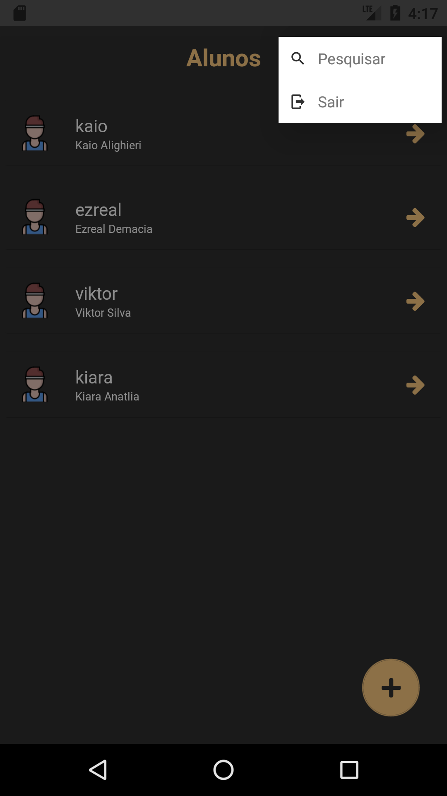

## Aplicativo que controla as fichas dos clientes da academia

### Tecnologias utilizadas:
* React Native
* Node
* Typescript
* Redux
* ...

## Tela de Login

 

## Home

 

## Home Menu

## Pesquisar

## Sair

 

## Adicionar novo aluno

 

## Home - Ações

 

## Editar usuário

 

## Treinos

 

## Adicionar Treino

 

## Treino - Ações

 

## Exercícios

 

## Exercícios - Ações

 

## Adicionar rxercício

